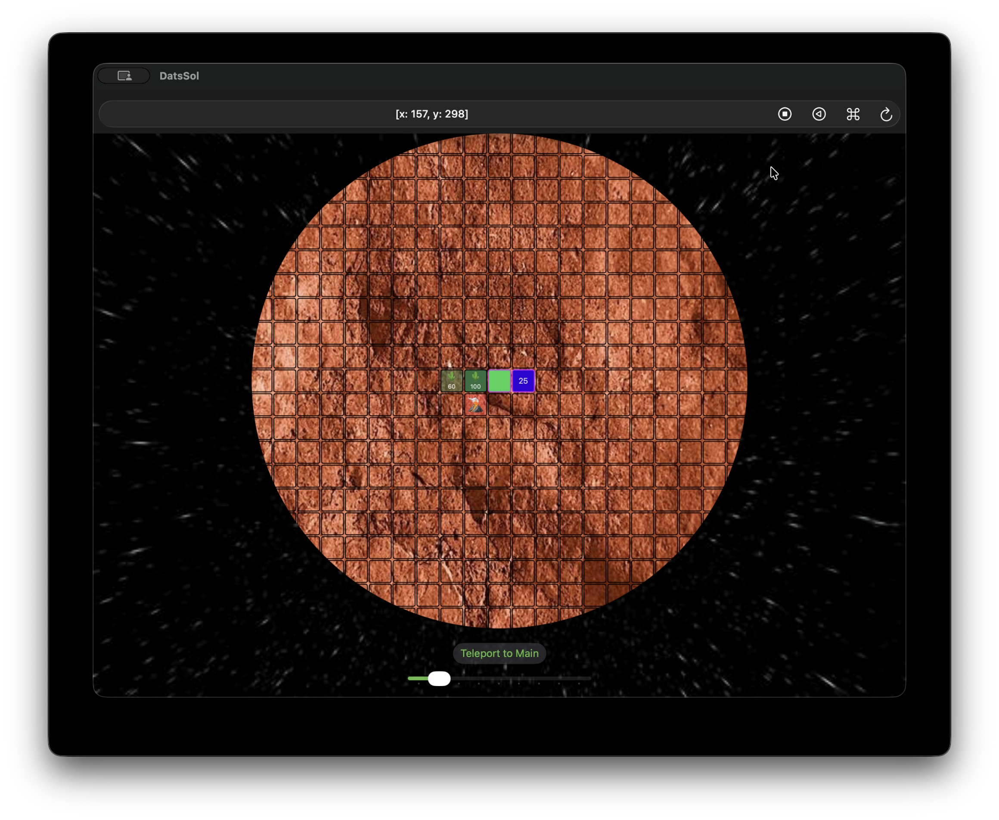
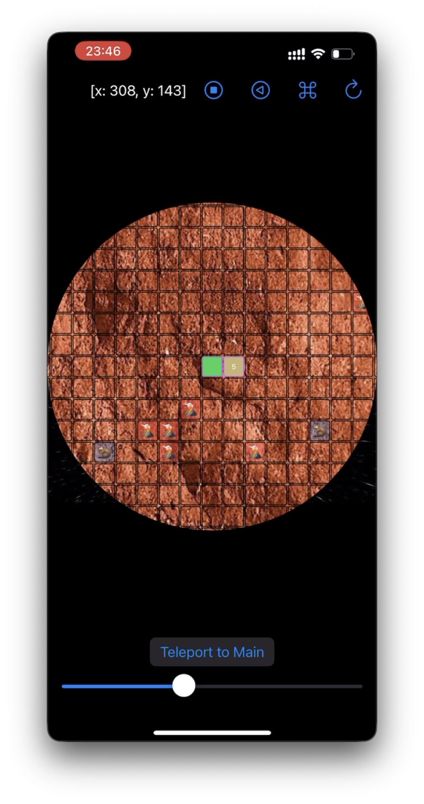
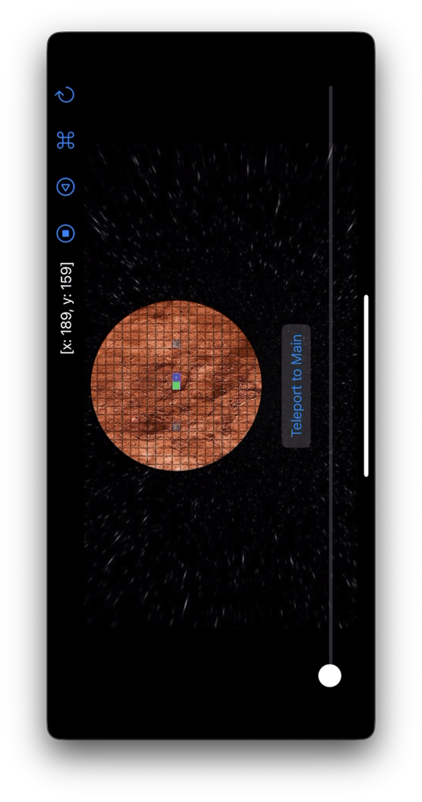

# DatsSol Application

This application was created to play DatsSol game as part of Dats team gamethon.\
The visual interface is implemented using SwiftUI for its simplicity and development speed compared to UIKit.\
URLSession and JSONEncoder/JSONDecoder are used for communication with game server.\
The game arena is visualized as the planet Mars in space to match the game theme.

<table frame="void" rules="none" border="0" cellspacing="0" cellpadding="0">
  <thead>
    <tr style="border: none;">
      <th style="border: none;" align="center">Mac representation</th>
    </tr>
  </thead>
  <tbody>
    <tr style="border: none;">
      <td width="70%"></td>
    </tr>
  </tbody>
</table>

<table frame="void" rules="none" border="0" cellspacing="0" cellpadding="0">
  <thead>
    <tr style="border: none;">
      <th style="border: none;" align="center">iPhone Vertical Representation</th>
      <th style="border: none;" align="center">iPhone Horizontal Representation</th>
    </tr>
  </thead>
  <tbody>
    <tr style="border: none;">
      <td style="border: none;" width="33%"></td>
      <td style="border: none;" width="66%"></td>
    </tr>
  </tbody>
</table>
